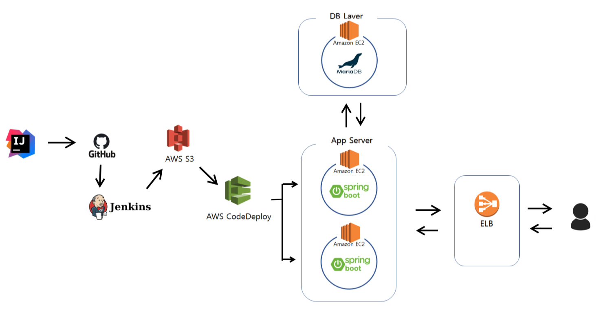

# advance-multi-module-lab [](https://travis-ci.org/cocota93/advance-multi-module-lab)



### 사용된 기술
- spring boot
- gradle
- JPA 
- Jpa data 
- QueryDsl 
- H2
- AWS EC2, S3, CodeDeploy, RDS(MariaDB), ELB 
- Jenkins  
- spring security form방식 - 어드민서버 적용
- spring security jwt방식 - api서버 적용
- swagger(springdoc openapi) - 어드민서버 적용
- restdoc - api서버 적용

### 멀티모듈 구조
```
application계층
  - boot-shop-app-admin
  - boot-shop-app-api

in system available계층
    - 추후 실사용때 추가
    
system domain계층
  - domain
    - Member
    - Notice
    - Operator
    - Cart
    - Product
    - ProductOrder
    - ProductOrderUnit
system core계층  
  - system-core
```

### 코드를 보는 방법
- spring security form : Operator를 중점으로
- spring security jwt : Member를 중점으로


### 코드 작성 규칙
- 이 프로젝트는 아직까지는 아주 간단한 CRUD만으로도 충분 하기 때문에 주문같은 복잡한 서비스를 구현하기 전까지는 각 도메인별 하나의 서비스클래스로 처리한다.
- Repo - Service형태로 구현하다가 Service쪽 로직이 너무 복잡해지고 각종 예외처리로 범벅되있다고 느끼면 그떄 Repo - Dao - Service형태로 리팩토링 하는게 맞는것 같다. 다만 어드민에있는 Member와 Notice에 페이징용 Query클래스들은 추후 어떤식으로 활용해야하는지 볼수있도록 남겨두고 활용한다.

### 참고했던 자료 및 사이트들
- 전체적으로 참고 ( https://github.com/didrlgus/springboot-shoppingmall )
- 예외처리 방식, Repositry와 Service클래스들을 어떤식으로 구성하여 활용하였는지 확인. Dao를 이용하여 추상화를 해둔 부분이 다른 프로젝트들과 차이점 ( https://github.com/cheese10yun/spring-guide )
- 멀티모듈, repository와 service클래스들을 어떻게 구성하고 활용하였는지 확인. ( https://github.com/woowacourse-teams/2020-6rinkers )
- jenkins를 이용한 무중단 배포 ( https://minholee93.tistory.com/entry/Jenkins-Springboot-Gradle-Github-CodeDeploy-ELB-2?category=924034)

그 외에 출처들은 커밋 히스토리에서 검색

