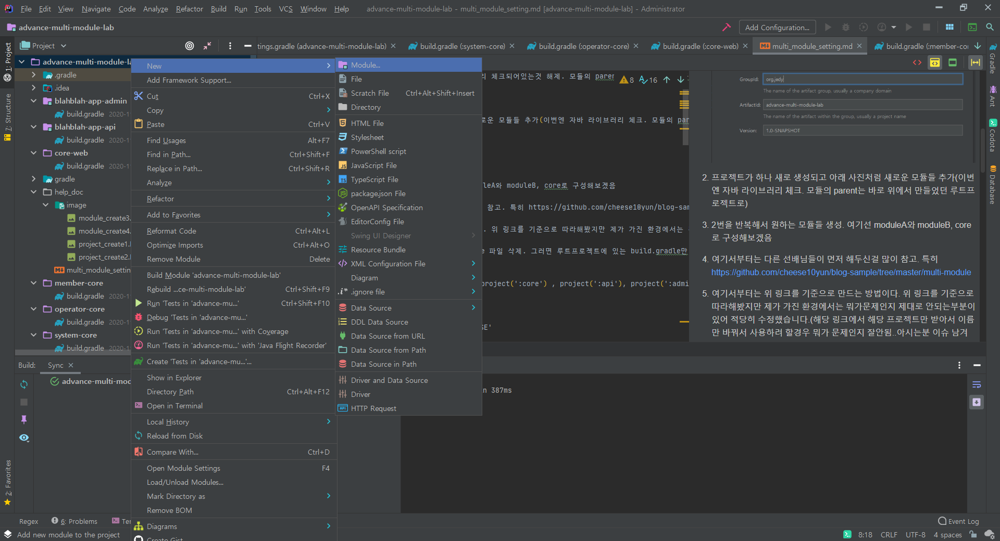
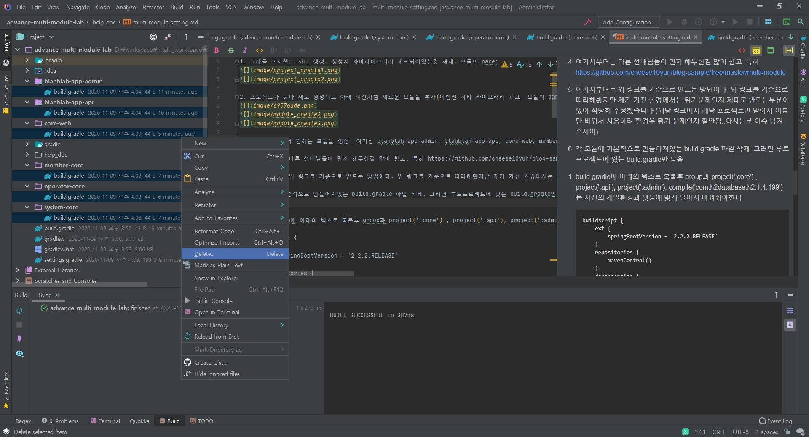

1. 그래들 프로젝트 하나 생성. 생성시 자바라이브러리 체크되어있는것 해제. 모듈의 parent는 none(groupid와 artifactid가 의미있는건지 정확히 모르겠다.)


2. 프로젝트가 하나 새로 생성되고 아래 사진처럼 새로운 모듈들 추가(이번엔 자바 라이브러리 체크. 모듈의 parent는 바로 위에서 만들었던 루트프로젝트로)



3. 2번을 반복해서 원하는 모듈들 생성. 여기선 blahblah-app-admin, blahblah-app-api, core-web, member-core, operator-core, system-core

4. 여기서부터는 다른 선배님들이 먼저 해두신걸 많이 참고. 특히 https://github.com/cheese10yun/blog-sample/tree/master/multi-module

5. 여기서부터는 위 링크를 기준으로 만드는 방법이다. 위 링크를 기준으로 따라해봤지만 제가 가진 환경에서는 뭐가문제인지 제대로 안되는부분이 있어 적당히 수정했습니다.(해당 링크에서 해당 프로젝트만 받아서 이름만 바꿔서 사용하려 할경우 뭐가 문제인지 잘안됨..아시는분 이슈 남겨주세여)

6. 각 모듈에 기본적으로 만들어져있는 build.gradle 파일 삭제. 그러면 루트프로젝트에 있는 build.gradle만 남음


7. build.gradle에 아래의 텍스트 복붙후 group과 project(':core') , project(':api'), project(':admin'), compile('com.h2database:h2:1.4.199') 는 자신의 개발환경과 셋팅에 맞게 알아서 바꿔줘야한다.  
    ```
    buildscript {
        ext {
            springBootVersion = '2.2.2.RELEASE'
        }
        repositories {
            mavenCentral()
        }
        dependencies {
            classpath("org.springframework.boot:spring-boot-gradle-plugin:${springBootVersion}")
            classpath "io.spring.gradle:dependency-management-plugin:1.0.6.RELEASE"
        }
    }
    
    subprojects {
        apply plugin: 'java'
        apply plugin: 'org.springframework.boot'
        apply plugin: 'io.spring.dependency-management'
    
        group = 'org.jedy'
        version = '0.0.1-SNAPSHOT'
        sourceCompatibility = '1.8'
    
        repositories {
            mavenCentral()
        }
    
        dependencies {
            compileOnly 'org.projectlombok:lombok'
            annotationProcessor 'org.projectlombok:lombok'
            implementation 'org.springframework.boot:spring-boot-starter-data-jpa'
        }
    
    //    task initSourceFolders {
    //        sourceSets*.java.srcDirs*.each {
    //            if (!it.exists()) {
    //                it.mkdirs()
    //            }
    //        }
    //
    //        sourceSets*.resources.srcDirs*.each {
    //            if (!it.exists()) {
    //                it.mkdirs()
    //            }
    //        }
    //    }
    
    }
    
    project(':system-core') {
        bootJar.enabled = false//main이 없는 모듈에는 다 포함 추가해줘야한다
        jar.enabled = true//main이 없는 모듈에는 다 포함 추가해줘야한다
    
        dependencies {
        }
    }
    
    project(':member-core') {
        bootJar.enabled = false//main이 없는 모듈에는 다 포함 추가해줘야한다
        jar.enabled = true//main이 없는 모듈에는 다 포함 추가해줘야한다
    
        dependencies {
            compile project(':system-core')
            
            compile('com.h2database:h2:1.4.199')
        }
    }
    
    project(':operator-core') {
        bootJar.enabled = false//main이 없는 모듈에는 다 포함 추가해줘야한다
        jar.enabled = true//main이 없는 모듈에는 다 포함 추가해줘야한다
    
        dependencies {
            compile project(':system-core')
    
            compile('com.h2database:h2:1.4.199')
        }
    }
    
    project(':core-web') {
        bootJar.enabled = false//main이 없는 모듈에는 다 포함 추가해줘야한다
        jar.enabled = true//main이 없는 모듈에는 다 포함 추가해줘야한다
    
        dependencies {
        }
    }
    
    
    project(':blahblah-app-api') {
        dependencies {
            compile project(':member-core')
            implementation 'org.springframework.boot:spring-boot-starter-web'
        }
    }
    
    project(':blahblah-app-admin') {
    
        dependencies {
            compile project(':operator-core')
            compile project(':member-core')
    
            implementation 'org.springframework.boot:spring-boot-starter-web'
        }
    }
    ```
   
 8. setting.gradle파일도 적당히 보고 바꿔주면 된다.
 
 9. 마지막으로 core모듈에 루트패키지(?) 만들때와 core모듈을 가져다 쓰는 다른 모듈들이 패키지 만들때가 좀 다르다.  
 만약 core모듈을 가져다 쓰는 모듈에서 org.jedy.admin에다가 main클래스를 가져다 놓으면 core모듈에서 만들어진 빈을 제대로 못가져온다.(이것도 왜그런지 모르곘다. 알면 이슈로 알려주세여)
 그래서 아래와같이 설정했다. 
 
 
 10. 돌려보면 잘동작한다. 끝.